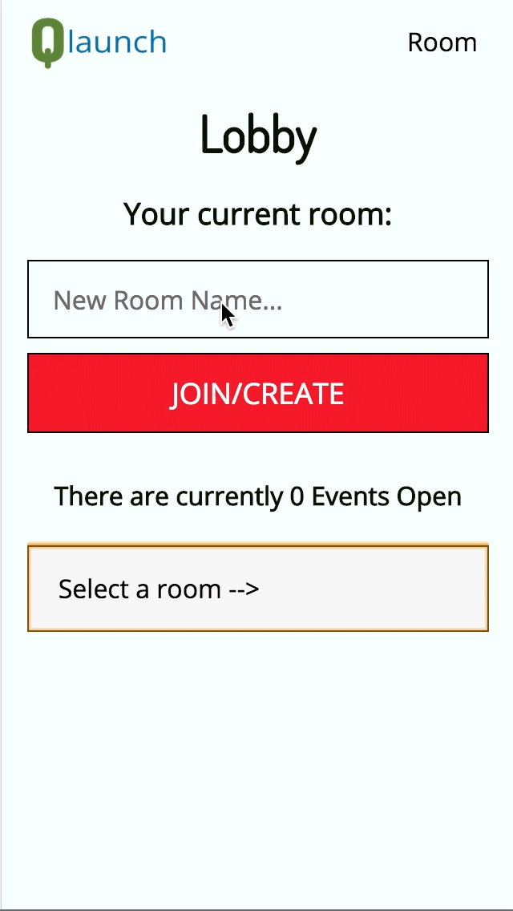
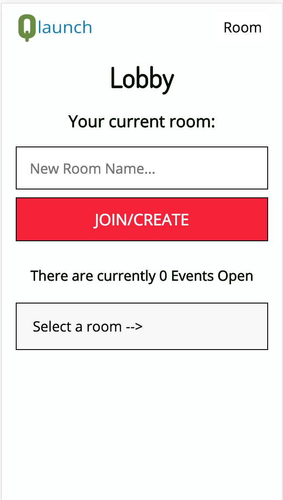
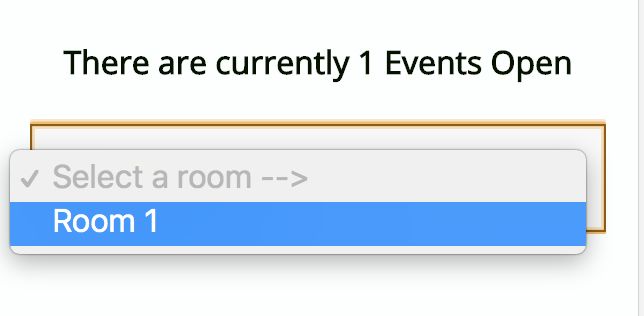
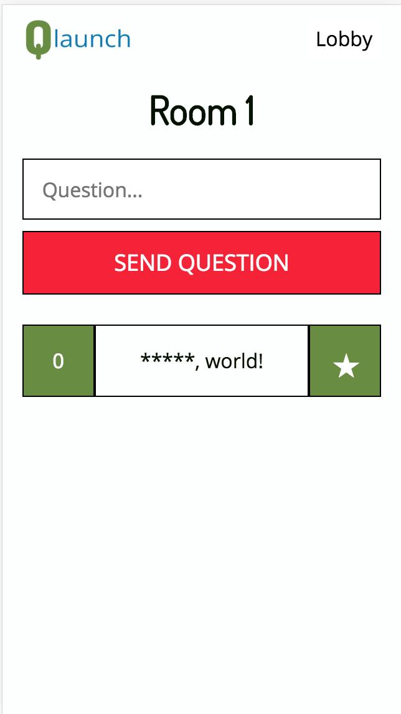
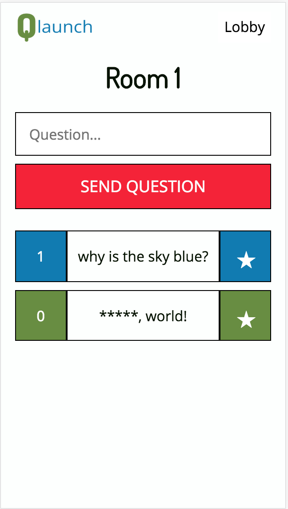

# [Questions by QLaunch](https://qlaunch.herokuapp.com)
A live question polling application. Great for meetings, town halls... Anytime people want to ask questions and you want to know which ones people care about the most.




## Table of Contents
* [Using the App](#use)
* [Technologies](#technologies)
* [Local Development Instructions](#development)
* [Team QLaunch](#team)
* [Special Thanks](#thanks)


## <a name="use"></a>Using The App

See the live demo at [https://qlaunch.herokuapp.com/](https://qlaunch.herokuapp.com/);

When you first arrive at the qLaunch app, you will see a form to create a room.  You will also see a list of available rooms to join.  Only rooms that currently have users in it are listed in the list of available rooms.





Upon creating a room or joining a room, you will be directed to that room.  Any questions in that room will be displayed with their current votes.  The questions will be displayed in order of highest votes to lowest.

Note that we have a strict profanity filter in place.

You can go back to lobby by clicking on the upper right button that says 'Lobby'.



You can vote by clicking on the star of a queston. You are allowed to vote once per question.  You can decide to "unvote" a question by simply clicking the vote button again. Questions you have voted on will turn blue.




## <a name="technologies"></a>Technologies
* React
* Socket.io
* Node.js
* Babel
* MongoDB
* Webpack
* Swiper
* Heroku


## <a name="development"></a>Local Development Instructions


### Installation

1. Run this command to install all dependencies
```
npm install
```

### Running the Server
1. Make sure you have your mongo database properly installed and your mongo daemon is running.  Ensure that the database is connecting to your locally run mongoDB.

2. Run this to run the server, run the build to create the front-end, and serve the front end.
```
npm run watch
```

Open your browser and type this in the address bar:
```
localhost:3000
```


## <a name="team"></a>The Team
Trevor Dobson: [LinkedIn](https://www.linkedin.com/in/trevorjdobson) || [GitHub](https://www.github.com/trevorjdobson)

Amber Kim: [LinkedIn](https://www.linkedin.com/in/ambergkim) || [GitHub](https://www.github.com/ambergkim) || [Portfolio](https://ambergkim.github.io)

Aaron Bruce: [GitHub](https://www.github.com/SilveredSliver)

## <a name="thanks"></a>Special Thanks
* [Tomasz Zwierzchon](https://medium.com/@tozwierz/testing-socket-io-with-jest-on-backend-node-js-f71f7ec7010f) for the socket.io testing boilerplate: 
* [Normalize.css](https://necolas.github.io/normalize.css/)
* [GitIgnore](https://www.gitignore.io/)
* [Bad Words](https://www.npmjs.com/package/bad-words)